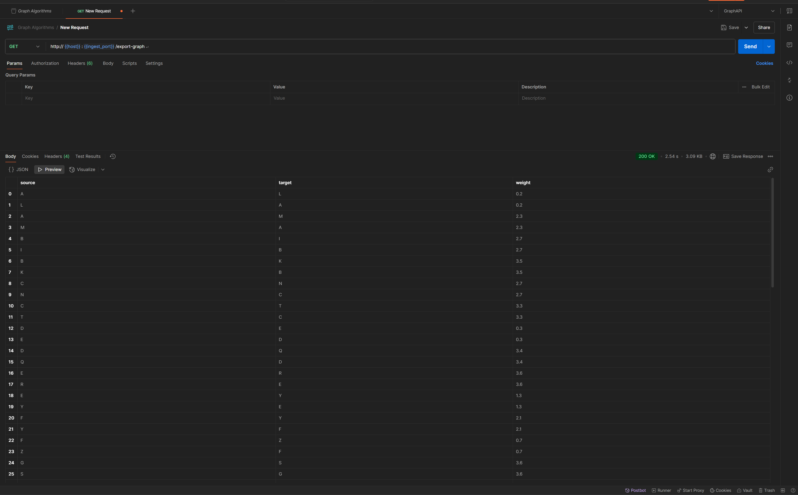
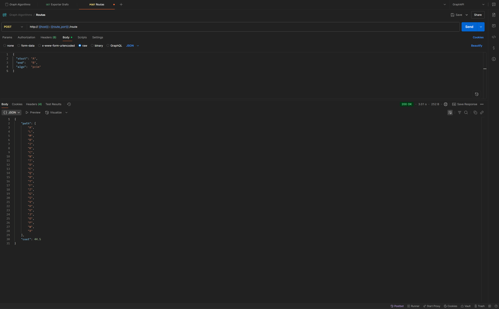

# Justificación

Este proyecto fue diseñado de forma didáctica para poder aprender y entender cómo funcionan los algoritmos de grafos como BFS, DFS y el de Prim. Para ello se utiliza la librería de Python llamada NetworkX y así realizar el análisis de los datos.

Por otro lado, se utiliza el proyecto como punto de partida para explorar qué es Neo4J, así como entender a nivel general el funcionamiento de las bases de datos orientadas a grafos. Es importante hacer la salvedad que únicamente es exploratorio y con fines de entendimiento, aplicando ideas creadas a partir de la indicación del entregable.

Se trabaja con una arquitectura de microservicios con el fin de emular un escenario lo más cercano a la realidad empresarial posible y que además permita la reutilización de segmentos de código en otros proyectos de exploración o incluso desarrollo más adelante.

El proyecto utiliza como base de datos a Neo4J, esto añade complejidad sin embargo exploramos términos avanzados que nos permiten comprender de forma introductoria el cómo funciona esta base de datos. Aparte del uso en Docker, se recomienda instalar Neo4J Desktop y ejecutar las consultas aquí compartidas, para visualizar la herramienta a nivel gráfico y familiarizarse con la misma.

# Arquitectura del proyecto

```bash
graph-analysis/
│
├── common/                         # Código compartido: logging, utils, etc.
│   └── logging_config.py           # Configuración de logging global
│
├── ingest-service/                 # Microservicio de exportación de datos desde Neo4j
│   ├── app/
│   │   ├── __init__.py
│   │   ├── main.py                 # FastAPI app con endpoint /export-graph
│   │   ├── neo4j_client.py         # Cliente Neo4j y consulta Cypher
│   │   └── schemas.py              # Pydantic models (GraphEdge, etc.)
│   ├── Dockerfile 
│   ├── README.md                   # Guía de microservicio
│   └── requirements.txt
│  
├── maintenance-service/            # Microservicio para calculo de nodos en mantenimiento
│   ├── app/
│   │   ├── __init__.py
│   │   ├── main.py                 # FastAPI app con endpoint /maintenance
│   │   ├── orchestrator.py         # Orquestador del calculo (Aritmetica Modular)
│   │   └── schemas.py              # Pydantic models
│   ├── data/
│   │   └── groups_map.json         # Arreglo con ciclos de mantenimiento
│   ├── Dockerfile 
│   ├── README.md                   # Guía de microservicio
│   └── requirements.txt
│
├── routing-service/                # Microservicio de cálculo de rutas
│   ├── app/
│   │   ├── __init__.py
│   │   ├── main.py                 # FastAPI app con endpoint /route
│   │   ├── orchestrator.py         # Lógica de orquestación de rutas
│   │   └── schemas.py              # Pydantic models (RouteRequest, RouteResponse)
│   ├── Dockerfile 
│   ├── README.md                   # Guía de microservicio
│   └── requirements.txt
│
├── graph-normalizer/               # Paquete reutilizable de carga y normalización
│   ├── __init__.py
│   ├── loader.py                   # Función que transforma JSON de ingest a NetworkX  
│   └── algorithms/                 # Implementaciones de BFS, DFS, Prim
│       ├── __init__.py
│       ├── bfs.py               
│       ├── dfs.py
│       ├── full.py
│       └── prim.py
│
├── queries/                        # Consultas para poblar datos de ejemplo
│   ├── README.md                   # Instrucciones de uso de Query's
│   ├── 01-nodos-clientes.cypher
│   ├── 02-nodos-cruces.cypher
│   └── 03-conexiones-bidireccionales.cypher
│                          
└── .env  
```

## Puertos Unificados

Este proyecto utiliza puertos consistentes tanto en modo local como Docker:

| Servicio | Puerto | URL | Descripción |
|----------|--------|-----|-------------|
| Neo4j Browser | 7474 | http://localhost:7474 | Interfaz web de Neo4j |
| Neo4j Bolt | 7687 | bolt://localhost:7687 ó bolt://neo4j:7687 | Conexión de base de datos |
| ingest-service | 8001 | http://localhost:8001 | API de exportación de grafos |
| routing-service | 8002 | http://localhost:8002 | API de cálculo de rutas |

**Ventaja**: Puedes usar la misma configuración de Postman sin importar el modo de ejecución.

# Preparación del entorno

## Subsistema de Linux para Windows WSL
Para poder ejecutar la aplicación he instalado el subsistema de Linux para Windows WSL, la documentación está en la siguiente página:

```bash
https://learn.microsoft.com/es-es/windows/wsl/install
```
*Instalar Ubuntu en el Subsistema de Linux para Windows.*

## Variables de entorno
Luego configuramos el .env:
```bash
NEO4J_URI=bolt://localhost:7687
NEO4J_USER=neo4j
NEO4J_PASSWORD=your_password
INGEST_LOGFILE=ingest.log
```

## Instalación de Docker
Descargar e instalar Docker Desktop para Windows. Importante: al ejecutar el instalador marcar la opción *"Use the WSL 2 based engine"*. Además, seleccionar la distribución Ubuntu, tal como hicimos en nuestro WSL.

Una vez instalado Docker ir a:
Configuración (Settings) → Recursos (Resources) → WSL Integration
Enable integration with additional distros: "Ubuntu"

Guardar y reiniciar.


Para probar que todo esté en orden, abrir el terminal de Linux:
```bash
docker --version

# Debería devolvernos la versión de docker
Docker version 28.3.2, build 578ccf6

# Luego probamos el contenedor de bienvenida
docker run --rm hello-world

# Si hay un mensaje de bienvenida todo está listo
```

## Entorno virtual dentro de WSL
Trabajaremos con entornos virtuales, así como realizaremos pruebas, instalaremos estas librerías:
```bash
sudo apt update

# Python y para crear entornos virtuales
sudo apt install python3 python3-venv python3-pip

# Para hacer bonito los JSON
sudo apt install jq

# Evita problemas con lectura de variables en Windows
sudo apt update && sudo apt install dos2unix
```

Crear entorno virtual usando terminal de Linux:
```bash
# En la carpeta raíz
cd ~/ruta/a/graph-analysis

# Crea el entorno virtual
python3 -m venv .venv

# Activar entorno virtual
source .venv/bin/activate

# Para salir del entorno virtual
deactivate
```

*Un entorno virtual instala librerías únicamente en el entorno aislado, evitando instalarlas en el sistema operativo, minimizando así problemas de compatibilidad entre librerías. Es útil cuando se desarrollan distintos sistemas que pueden necesitar distintas librerías que no son compatibles entre sí.*

Ahora sí, con el entorno virtual activado instalamos librerías:
```bash
# Primero actualiza pip
pip install --upgrade pip

# Instalar paso a paso según requirements.txt:
pip install -r ingest-service/requirements.txt
pip install -r routing-service/requirements.txt
```

## Levantar Neo4j en Docker
Usando la consola de Linux vamos a ejecutar los siguientes comandos:
```bash
# Ir a la raíz del proyecto
cd graph-analysis

# Normalizamos el .env para Unix
dos2unix .env

# Crea un repositorio persistente de los datos
mkdir -p ~/neo4j-data

# Cargue su .env en el terminal
set -o allexport
source .env
set +o allexport

# Verificar variable de entorno 
echo "Password en shell: [$NEO4J_PASSWORD]"

# Levanta la instancia de neo4j
docker run -d --name neo4j-wsl \
  -p 7474:7474 \
  -p 7687:7687 \
  -e NEO4J_AUTH="neo4j/$NEO4J_PASSWORD" \
  -v ~/neo4j-data:/data \
  neo4j:5.9
```

Comandos clave, de ahora en adelante para levantar o frenar nuestra base de datos haremos lo siguiente:

```bash
# Levantar Base
docker start neo4j-wsl

# Detener Base
docker stop neo4j-wsl

# Ver Logs
docker logs -f neo4j-wsl
```
*Sí, es necesario levantar la base para que nuestro sistema funcione.*

# Microservicios

## Creación de base Neo4J (Docker)
Si ha seguido los pasos a este punto tendremos una base de datos orientada a grafos levantada en Docker. Esta está vacía, pero tiene persistencia de datos, necesitamos poblar esta base para realizar nuestras pruebas.

Vamos a ir al README que se aloja dentro de *"queries"*, seguimos los pasos, esto va a poblar con datos para nuestro ejemplo la base, se basan en un laboratorio universitario.

## Conexión con Neo4J (ingest-service)

Debemos levantar los distintos microservicios. Primero, tenemos *ingest-service*, este microservicio lo que hace es conectarse a la base de datos de Neo4J y permitirnos realizar consultas a la base de datos.

Para levantar el microservicio:
```bash
# Ir a la raíz del proyecto
cd graph-analysis

# Activamos nuestro entorno virtual
source .venv/bin/activate

# Instalamos requerimientos si no lo hemos hecho
pip install -r ingest-service/requirements.txt

# Levantamos servidor
uvicorn ingest-service.app.main:app --reload --host 127.0.0.1 --port 8001
```

Una vez levantado uvicorn abrimos otra consola sin cerrar la actual. Como recomendación, siempre renombro mis consolas para saber qué estoy haciendo en cada una, a esta le puse *ingest-service*. En la otra consola lo que vamos a probar es que la consulta funcione, por ende que exista conexión.

Para probar la conexión:
```bash
curl -s http://127.0.0.1:8001/export-graph | jq .
```
*Debería devolver los datos en formato JSON, a este punto ya tenemos que haber seguido las instrucciones dentro del README.md que está en queries.*

## Arrancar el Routing-Service
Abrimos una nueva consola, ejecutamos lo siguiente:

```bash
# Ir a la raíz del proyecto
cd graph-analysis 

# Activamos nuestro entorno virtual en esta nueva consola
source .venv/bin/activate

# Instalamos requerimientos si no lo hemos hecho
pip install -r routing-service/requirements.txt

# Levantamos servicio de rutas
uvicorn routing-service.app.main:app \
  --reload --host 127.0.0.1 --port 8002
```

# Levantar el Backend
Siguiendo todos los pasos podemos levantar el sistema de forma sencilla. Primero abrimos 3 consolas y las renombramos, todas en Linux (WSL):
- neo4j-docker
- ingest-server
- routing-service

### neo4j-docker
```bash
docker start neo4j-wsl
```

### ingest-server
```bash
cd graph-analysis
source .venv/bin/activate

uvicorn ingest-service.app.main:app --reload --host 127.0.0.1 --port 8001
```

### routing-service
```bash
cd graph-analysis
source .venv/bin/activate

uvicorn routing-service.app.main:app \
  --reload --host 127.0.0.1 --port 8002
```

# Probar en Postman
Creamos una carpeta, en mi caso la llamaré *Graph Algorithms*, creamos un nuevo *Environment*, le pondremos *GraphAPI* y usaremos las siguientes variables:

- host = 127.0.0.1
- ingest_port = 8001
- route_port = 8002

### export-graph (GET)
http://{{host}}:{{ingest_port}}/export-graph

Veremos un JSON con la información en nuestra base de datos o bien la tabla con los nodos y el peso de las aristas.


### route (POST)
http://{{host}}:{{route_port}}/route

Definimos en el body (RAW) los parámetros que espera nuestro sistema:
```json
{
  "start": "A",
  "end":   "B",
  "algo":  "prim"
}
```
Veremos un JSON con la información del path seguido por el algoritmo seleccionado.


Recordemos que la variable "algo" espera el algoritmo, ahí solo cambiamos cual queremos ejecutar:
- "bfs"
- "dfs"
- "prim"

# Despliegue en Docker
El despliegue que hemos realizado a este punto ha sido manual, y es muy útil para comprender cómo funciona el sistema y qué operaciones realiza. Sin embargo, para simplificarlo y tener algo más robusto similar a lo que veríamos en un entorno empresarial, podemos desplegar el sistema en Docker mediante el uso de imágenes.

Primero, cambiaremos nuestro .env para que sea compatible con Docker y no el modo de pruebas locales, tenemos que descomentar *NEO4J_URI=bolt://neo4j:7687 Para Docker* y comentar *NEO4J_URI=bolt://localhost:7687*:
```bash
# NEO4J_URI=bolt://localhost:7687
NEO4J_URI=bolt://neo4j:7687       # Para Docker
NEO4J_USER=neo4j
NEO4J_PASSWORD=your_password_here
INGEST_LOGFILE=ingest.log
INGEST_SERVICE_URL=http://ingest-service:8001/export-graph
ROUTING_LOGFILE=routing.log
```

Guardamos los cambios y estando en la carpeta raíz ejecutamos:
```bash
docker-compose up --build
```
*Nota: esto ejecutará la creación de imágenes, los servicios quedarán arriba, para frenarlos únicamente utilizar CTRL + C.*

Una vez creados los contenedores podemos nuevamente levantar nuestro sistema con el siguiente comando:
```bash
docker-compose up -d
```

También podemos verificar los servicios levantados con:
```bash
docker-compose ps
```

Incluso podemos abrir otra consola para monitorear los logs de nuestra aplicación:
```bash
docker-compose logs -f ingest-service routing-service
```

Podemos detener los servicios en cualquier momento con:
```bash
docker-compose down
```

## Configuración de Postman para Docker
Cuando ejecutemos en modo Docker, los puertos son los mismos, por lo que **NO necesitas cambiar tu configuración de Postman**. Las variables del environment siguen siendo:

- host = 127.0.0.1
- ingest_port = 8001
- route_port = 8002

Esto es así porque Docker mapea los puertos internos a los mismos puertos externos para mantener consistencia entre ambos modos de ejecución.