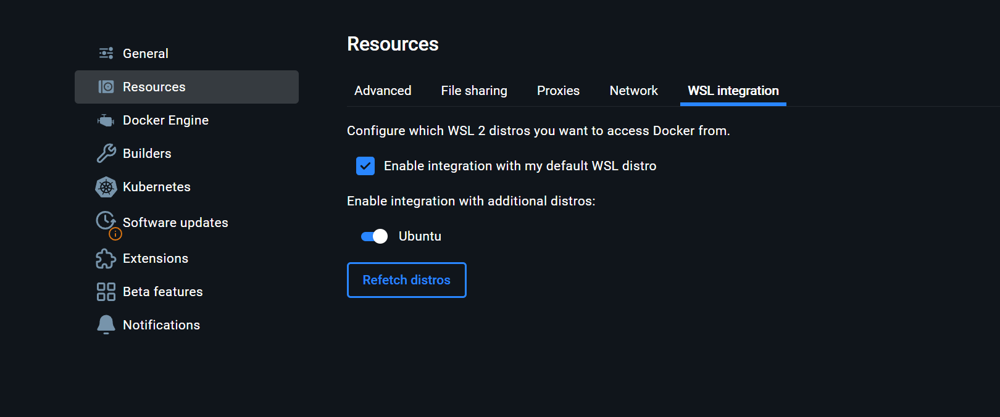

# Justificación

Este proyecto fue diseñado de forma didáctica para poder aprender y entender como funcionan los algoritmos de grafos como BFS, DFS y el de Prim, para ello
se utiliza la libreria de Python llamada NetworkX y así realizar el analisis de los datos.

Por otro lado, se utiliza el proyecto como punto de partida para explorar que es Neo4J, así como entender a nivel general el funcionamiento de las bases de
datos orientadas a grafos, es importante hacer la salvedad que unicamente es exploratorio y con fines de entendimiento aplicando ideas creadas a partir 
de la indicación del entregable.

Se trabaja con una arquitectura de microservicios con el fin de emular un escenario lo mas cercano a la realidad empresarial posible y que ademas permita la reutilización 
de segmentos de código en otros proyectos de exploración o incluso desarrollo mas adelante.

El proyecto utiliza como base de datos a Neo4J, esto añade complejidad sin embargo exploramos términos avanzados que nos permiten comprender de forma introductoria el como funciona esta base de datos,
aparte del uso en Docker se recomienda instalar Neo4J Desktop y ejecutar las consultas aquí comaprtidas, para visualziar la herramienta a nivel gráfico y familizarizarse con la misma.

# Arquitectura del proyecto

```bash
graph-analysis/
│
├── common/                         # Código compartido: logging, utils, etc.
│   └── logging_config.py           # Configuración de logging global
│
├── ingest-service/                 # Microservicio de exportación de datos desde Neo4j
│   ├── app/
│   │   ├── __init__.py
│   │   ├── main.py                 # FastAPI app con endpoint /export-graph, llamar logger
│   │   ├── neo4j_client.py         # Cliente Neo4j y consulta Cypher
│   │   └── schemas.py              # Pydantic models (GraphEdge, etc.)
│   └── requirements.txt
│
├── routing-service/                # Microservicio de cálculo de rutas
│   ├── app/
│   │   ├── __init__.py
│   │   ├── main.py                 # FastAPI app con endpoint /route
│   │   ├── orchestrator.py         # Lógica de orquestación de rutas
│   │   └── schemas.py              # Pydantic models (RouteRequest, RouteResponse)
│   └── requirements.txt
│
├── graph-normalizer/               # Paquete reutilizable de carga y normalización
│   ├── __init__.py
│   ├── loader.py                   # Función que transforma JSON de ingest a NetworkX  
│   └── algorithms/                 # Implementaciones de BFS, DFS, Prim
│       ├── __init__.py
│       ├── bfs.py               
│       ├── dfs.py
│       └── prim.py
│
├── queries/                        # Consultas para poblar datos de ejemplo
│   ├── README.md                   # instrucciones de uso de Query's
│   ├── 01-nodos-clientes.cypher
│   ├── 02-nodos-cruces.cypher
│   └── 03-conexiones-bidireccionales.cypher
│                          
└── .env  
```

# Preparación del entorno

## Subsistema de Linux para Windows WSL
Para poder ejecutar la aplicación he instalado el subsitema de Linux para Windows WSL, la documentación está en la siguiente página.

```bash
https://learn.microsoft.com/es-es/windows/wsl/install
```
*Instalar Ubunbu en el Subsistema de Linux para Windos.*

## Variables de entorno
Luego configuramos el .env.
```bash
NEO4J_URI=bolt://localhost:7687
NEO4J_USER=neo4j
NEO4J_PASSWORD=your_password
INGEST_LOGFILE=ingest.log
```

## Instalación de Docker
Descargar e instalar Docker Desktop para Windows. Importante al ejecutar el instalador marcar la opción *"Use the WSL 2 based engine"*. Ademas seleccionar la distribución Ubuntu, tal como hicimos en nuestro WSL.

Una vez instalado Docker ir a:
Configuración (Settings) → Recursos (Resources) → WSL Integration
Enable integration with additional distros: "Ubuntu"

Guardar y reiniciar.



Para probar que todo esté en orden, abrir el terminal de Linux 
```bash
docker --version

# Debería devolvernos la versión de docker
Docker version 28.3.2, build 578ccf6

# Luego probamos el contenedor de bienvenida
docker run --rm hello-world

# Si hay un mensaje de bienvenida todo está listo
```

## Entorno virtual dentro de WSL
Trabajaremos con entornos virtuales, así como realizaremos pruebas, intalaremos estas librerias
```bash
sudo apt update

# Python y para crear entornos virtuales
sudo apt install python3 python3-venv python3-pip

# Para hacer bonito los JSON
sudo apt install jq

# Evita problemas con lectura de variables en Windows
sudo apt update && sudo apt install dos2unix
```

Crear entorno virtual usando terminal de Linux
```bash
# En la carpeta raiz
cd ~/ruta/a/graph-analysis

# Crea el entorno virtual
python3 -m venv .venv

# Activar entorno virtual
source .venv/bin/activate

# Para salir del entorno virtual
deactivate
```

*Un entorno virtual isntala librerias unicamente en el entorno aislado, evitando isntalarlas en el sistema operativo, minimizando así probelams de compatibilidad entre librerias, util cuando se desarrollan distintos sistemas que pueden necesitar distintas librerias que no son compatibles entre si.*

Ahora si, con el entorno virtual activado instalamos librerias
```bash
# Primero actualiza pip
pip install --upgrade pip

# Instalar paso a paso según requirements.txt:
pip install -r ingest-service/requirements.txt
pip install -r routing-service/requirements.txt
```

## Levantar Neo4j en Docker
Usando la consola de Linux vamos a ejecutar los siguientes comandos
```bash
# Ir a la raiz del proyecto
cd graph-analysis

# Normalizamos el .env para Unix
dos2unix .env

# Crea un repositorio persistente de los datos
mkdir -p ~/neo4j-data

# Cargue su .env en el terminal
set -o allexport
source .env
set +o allexport

# Verificar variable de entorno 
echo "Password en shell: [$NEO4J_PASSWORD]"

# Levanta la instancia de neo4j
docker run -d --name neo4j-wsl \
  -p 7474:7474 \
  -p 7687:7687 \
  -e NEO4J_AUTH="neo4j/$NEO4J_PASSWORD" \
  -v ~/neo4j-data:/data \
  neo4j:5.9
```

Comandos clave, de ahora en adleante para levantar o frenar nuestra base de datos haremos lo siguiente

```bash
# Levantar Base
docker start neo4j-wsl

# Detener Base
docker stop neo4j-wsl

# Ver Logs
docker logs -f neo4j-wsl
```
*Si, es necesario levantar la base para que nuestro sistema funcione*

# Microservicios

## Creación de base Neo4J (Docker)
Si ha seguido los pasos a este punto tendremos una base de datos orientada a grafos levantada en Docker, esta, está vacia, pero tiene persistencia de datos, necesitamos poblar esta base para realizar nuestras pruebas.

Vamos a ir al readme que se aloja dentro de *"queries"*, seguimos los pasos, esto va a poblar con datos para nuestro ejemplo la base, se basan en un laboratorio universitario.

## Conexión con Neo4J (ingest-service)

Debemos levantar los distintos microservicios, primero, tenemos *ingest-service*, este microservicio lo que hace es conectarse a la base de datos de Neo4J y permitirnos realizar consultas a la base de datos.


Para levantar el microservicio:
```bash
# Ir a la raiz del proyecto
cd graph-analysis

# Activamos nuestro entrono virtual
source .venv/bin/activate

# Instalamos requerimientos si no lo hemos hecho
pip install -r ingest-service/requirements.txt

# Levantamos servidor
uvicorn ingest-service.app.main:app --reload --host 127.0.0.1 --port 8000
```

Una vez levantado uvicorn abrimos otra consola sin cerrar la actual, como recomendación siempre renombro mis consolas para saber que estoya haciendo en cada una, a esta le puse *ingest-service*, en la otra consola lo que vamos a probar es que la consulta funcione, por ende que exista conexión.

Para probar la conexión
```Bash
curl -s http://127.0.0.1:8000/export-graph | jq .
```
*Debería devolver los datos en formato JSON, a este punto ya tenemos que haber seguido las instruccones dentro del README.md que está en queries*

## Arrancar el Routing-Service
Abrimos una nueva consola, ejecutamos lo siguiente

```bash
# Ir a la raiz del proyecto
cd graph-analysis 

# Activamos nuestro entrono virtual en esta nueva consola
source .venv/bin/activate

# Instalamos requerimientos si no lo hemos hecho
pip install -r routing-service/requirements.txt

# Levantamos servicio de rutas
uvicorn routing-service.app.main:app \
  --reload --host 127.0.0.1 --port 8001
```


# Levantar el Backend
Siguiendo todos los pasos podemos levantar el sistema de forma sencilla, primero abrimos 3 consolas y las renombramos, todas en linux (WSL):
- neo4j-docker
- ingest-server
- routing-service

### neo4j-docker
```bash
docker start neo4j-wsl
```

### ingest-server
```bash
cd graph-analysis
source .venv/bin/activate

uvicorn ingest-service.app.main:app --reload --host 127.0.0.1 --port 8000
```

### routing-service
```bash
cd graph-analysis
source .venv/bin/activate

uvicorn routing-service.app.main:app \
  --reload --host 127.0.0.1 --port 8001
```

# Probar en Postman
Creemos una carpeta, en mi caso la llamaré *Graph Algorithms*, creamos un nuevo *Environment*, le pondremos *GraphAPI* y usaremos las siguientes variables

- host = 127.0.0.1
- ingest_port = 8000
- route_port = 8001

### export-graph (GET)
http://{{host}}:{{ingest_port}}/export-graph

Veremos un JSON con la información en nuestra base de datos o bien la tabla con los nodos y el peso de las aristas.


### route (POST)
http://{{host}}:{{route_port}}/route

Definimos en el body (RAW) los parametros que espera nuestro sistema.
```bash
{
  "start": "A",
  "end":   "B",
  "algo":  "prim"
}
```

Recordemos que la variable "algo" espera el algoritmo, ahi solo cambiamos cual queremos ejecutar.
- "bfs"
- "dfs"
- "prim"

